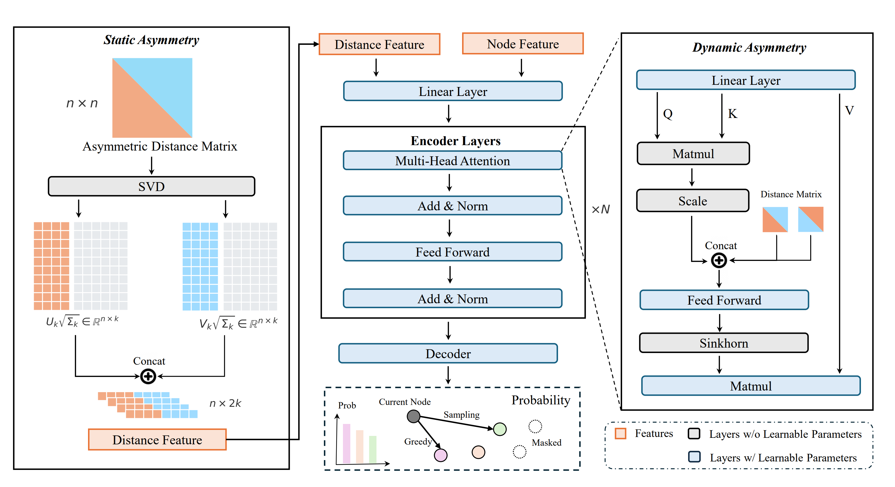

# RADAR: Learning to Route with Asymmetry-aware DistAnce Representations

**Hang Yi**, **Ziwei Huang**, **Yining Ma**, **Zhiguang Cao**

Paper: [[RADAR]](https://openreview.net/forum?id=lWdxX5s9T1)

---

## Overview

RADAR is a neural combinatorial optimization framework designed for solving asymmetric routing problems, such as the Asymmetric Traveling Salesman Problem (ATSP). It enhances neural VRP solvers with the ability to effectively handle asymmetric distance matrices. RADAR leverages Singular Value Decomposition (SVD) to initialize compact embeddings that capture static asymmetry, and introduces Sinkhorn normalization to model dynamic asymmetry during attention interactions. Extensive experiments on synthetic and real-world benchmarks demonstrate strong generalization and superior performance across various asymmetric VRPs.

---

## Framework

<p align="center">

</p>

## Dataset and Checkpoints

The datasets and pretrained checkpoints used in our experiments can be downloaded from the following links:

- **ATSP dataset:** [[Download link]](https://drive.google.com/file/d/1dwKlConq9AhOObcTu-57wOsxr47FEhHU/view?usp=sharing)
- **ACVRP dataset:** [[Download link]](https://drive.google.com/file/d/1OdzFHqj_kvaSgHMRO0l4nvEuyr7RV2fK/view?usp=sharing)

- **ATSP checkpoint:** [[Download link]](https://drive.google.com/file/d/1vO98NyK3DAaDBAJa5Y6bzWLfyM8QGs_0/view?usp=sharing)
- **ACVRP checkpoint:** [[Download link]](https://drive.google.com/file/d/10GFNnGh8pKHZbA-YqkhJj3YdaCEIpzic/view?usp=sharing)

After downloading the files, please unzip them and place them into the corresponding ATSP and ACVRP folders. For instance, place the ATSP dataset directly under the `atsp` directory, and the pretrained checkpoint under `atsp/result/`.

The directory structure should look like:

RADAR  
│  
├── atsp  
│   ├── dataset  
│   │   └── (ATSP dataset files)  
│   │  
│   └── result  
│       └── radar_official_checkpoint

## Training and Testing

### ATSP

As an example, we describe how to train and evaluate RADAR on the ATSP task.

First, navigate to the `atsp` directory:

```bash
cd atsp
```

### Training

To train the model, run:

```bash
python train.py
```

Before testing, please modify the parameter `problem_cnt` in `test.py` to select the dataset size.

You can evaluate the model on the following problem sizes:

- `problem_cnt = 100`
- `problem_cnt = 200`
- `problem_cnt = 500`
- `problem_cnt = 1000`

After setting the desired problem size, run:

```bash
python test.py
```
```bash

## Reference

If you find this work or code useful, please consider citing our paper:
@inproceedings{yiradar,
  title={RADAR: Learning to Route with Asymmetry-aware Distance Representations},
  author={Yi, Hang and Huang, Ziwei and Cao, Zhiguang and Ma, Yining},
  booktitle={The Fourteenth International Conference on Learning Representations}
}
```
